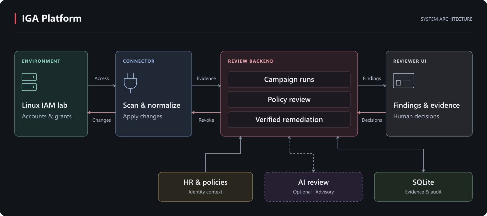
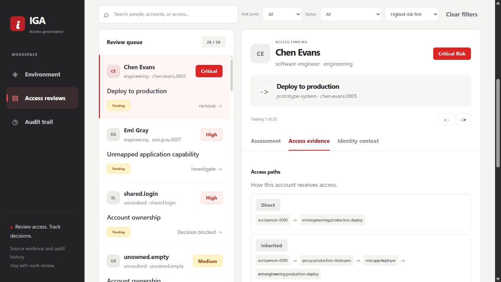

# IGA Platform

An access review prototype that connects HR policies with observed access.
Inspect an environment, review findings, approve changes, and verify removals
with a fresh scan. AI assessments support human decisions.

## Architecture

[](docs/images/architecture.svg)

Built with Python, FastAPI, SQLite, and vanilla JavaScript.

## Access review

Review evidence and record decisions in one workspace.



[View the environment dashboard](docs/images/environment-review-ready.png)

## Run the demo

Follow the [setup guide](docs/SETUP-AND-RUN-GUIDE.md#environment-first-quick-start-windows)
to install the dependencies, then run from the repository root in PowerShell:

```powershell
.\scripts\start-demo.ps1
```

Open [localhost:8043](http://127.0.0.1:8043), sign in with the generated token,
and select **Start access review**. The demo uses simulated access and offline
rules. State is saved between runs; use `-StateDir .demo-review/new-demo` for
a fresh start.

## Documentation

- [Setup, configuration, and tests](docs/SETUP-AND-RUN-GUIDE.md)
- [Review workflow and validation status](governance-platform/access-review/README.md)
- [API and data contracts](governance-platform/access-review/docs/contract.md)

Local automated tests cover review runs, authorization, recovery, remediation,
and UI behavior. Live Linux changes and external AI quality still need validation.
